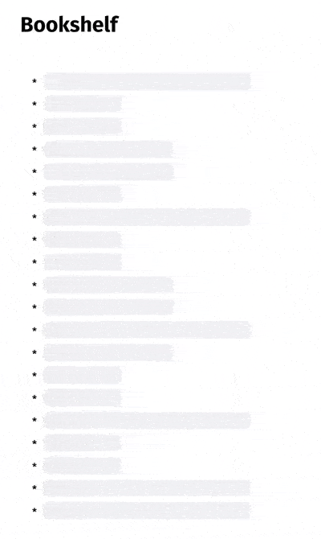

# Goodreads Widget

A simple HTML + JS widget that enables you to embed your Goodreads bookshelf into your  website/blog.
Using Javascript's Fetch & DOM API. No external dependencies, not even jquery.

<p align="center">

</p>

## Prerequisites
1. NodeJS 12++
2. NPM 5.3++  with `npx` already included.

##  Preparation
1. Register for [Goodreads API KEY](https://www.goodreads.com/api/keys).
2. Note your Goodreads user id. Open Goodreads, click your profile picture on the upper-right, click profile. Look at the address bar. It looks like this:
    ```
    https://www.goodreads.com/user/show/12345678-jon-snow
    ```
    That `12345678` number in front of your name is your user id.
3. Clone this repo and enter inside the repo's directory.
    ```bash
    git clone 
    cd goodreads-widget
    ```
4. Create a bash script file, for example `env.sh`.
    ```sh
    vim env.sh
    ```
5. Fill the `env.sh` with the following lines:
    ```sh
    export GOODREADS_API_KEY={{YOUR_GOODREADS_API_KEY}}
    export GOODREADS_USER_ID={{YOUR_GOODREADS_USER_ID}}
    ```
    Replace the `{{YOUR_GOODREADS_API_KEY}}` with your own Goodreads API key, and `{{YOUR_)GOODREADS_USER_ID}}` with  your Goodreads user id.
6. Make `env.sh` executable and execute it.
    ```bash
    chmod +x env.sh
    source env.sh
    ```
7. Init NPM.
    ```bash
    npm install
    ```
8.  Compile the script.
    ```bash
    npx webpack
    ```
9.  The script will be available in `dist/main.js`. You can move this script to your project.

## Usage

1.  To include it into your HTML page, you must have an element with ID `bookshelf-widget`. Then include the script you already compiled with script tag. For example:
    ```html
    <!doctype html>
    <html>
        <head>
        	<title>Getting Started</title>
      	</head>
      	<body>
    		<section id="bookshelf-widget">
    		    <script src="main.js"></script>  
    		</section>
    	</body>
    </html>
    ```
3.  Open your HTML page in the browser.

## Settings
1. Open `src/index.js`
2. To change the shelf you want to show, change the `shelf` variable into your prefered shelf name. For example "currently-reading".
    ```javascript
    const shelf = "currently-reading"
    ```
3. To change how many books  you w ant to load per batch, change the `perPage` variable. The valid  value is integer in the range of `1-200`. For example:
    ```javascript
    var perPage = 20;
    ```

 ## Styling
 1. All the stylings required are inside `src/styles/app.css`.   

## License
MIT